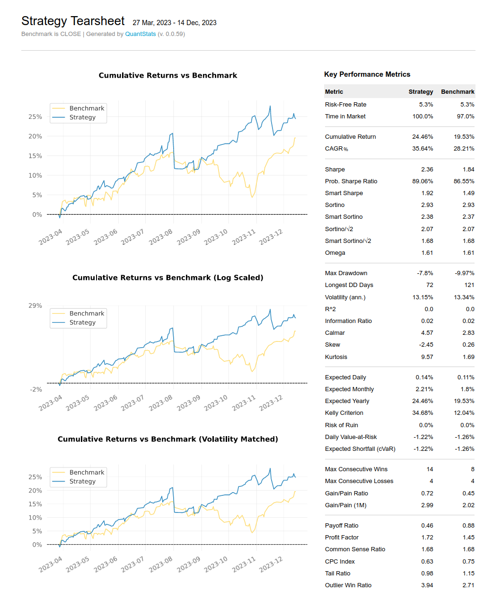
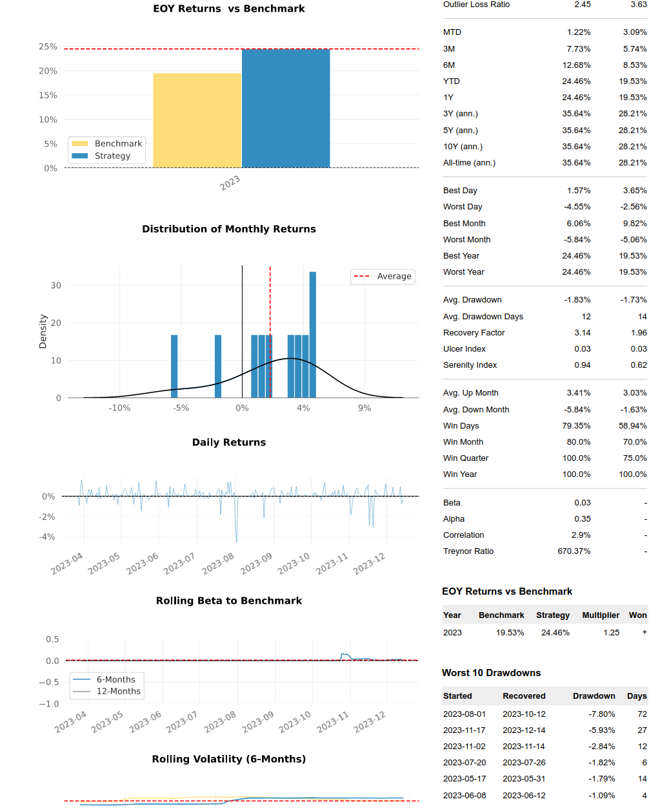
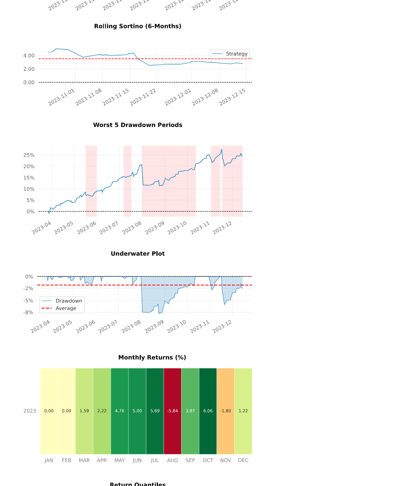
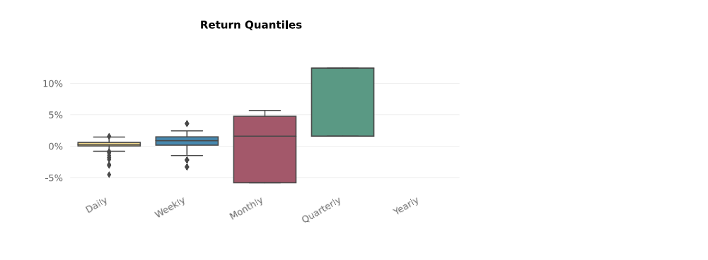

# Account 1 Trading Example
This account began with $200,000. The following images show the trading history from 03/27/2023 to 12/14/2023. This strategy was valued against a Benchmark of SPY returns. The trading strategy was developed from my quantitative analysis of our company's proprietary variables and signals along with a few risk management strategies.

The following images were created utilizing Quantstats. You can find this project outlined in the quanstats_tearsheets folder in this repository. 

