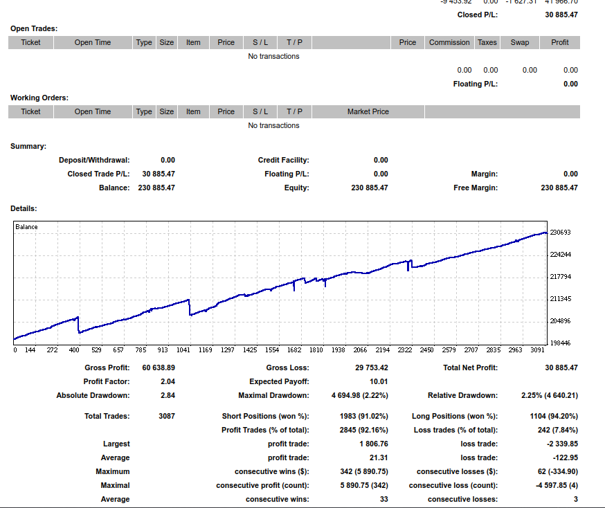
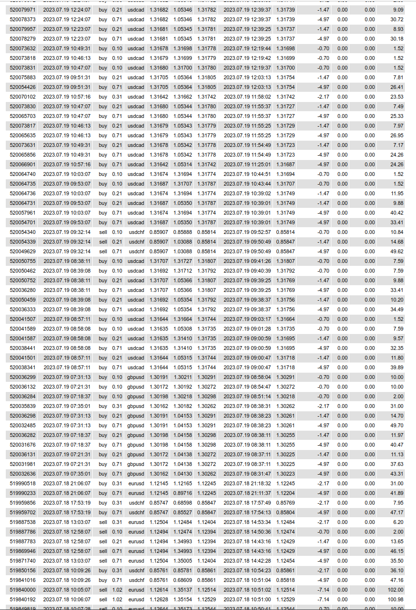

# Account 2 Trading Example
This paper trading account began with about $196,000. The following images show the trading history from March 2023 to August 2023. The trading strategy was developed from my quantitative analysis of our company's proprietary variables and signals along with a few risk management strategies. A total of 3087 trades were enacted during this period. 

# Example trades used in this strategy
The following is a small sample of trades that were generated by the trading strategy

