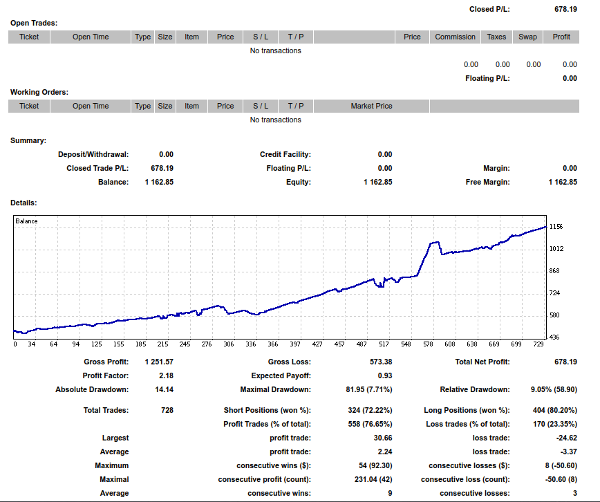
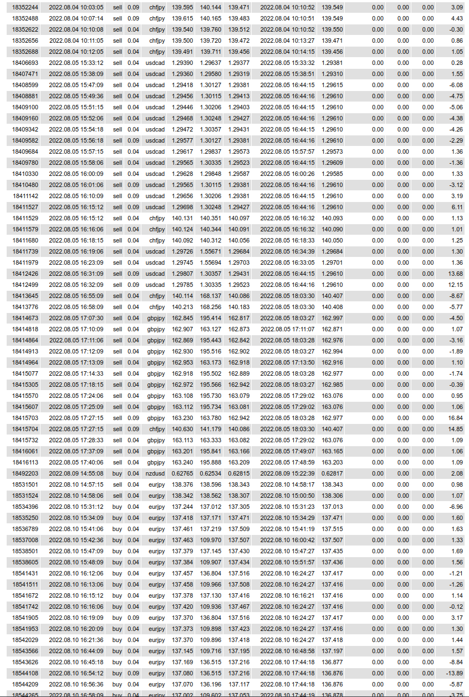

# Account 3 Trading Example
This live trading account began with about $450. The following images show the trading history from July 2022 to November 2022. The trading strategy was developed from my quantitative analysis of our company's proprietary variables and signals along with a few risk management strategies. A total of 728 trades were enacted during this period. 

# Example trades used in this strategy
The following is a small sample of trades that were generated by the trading strategy

